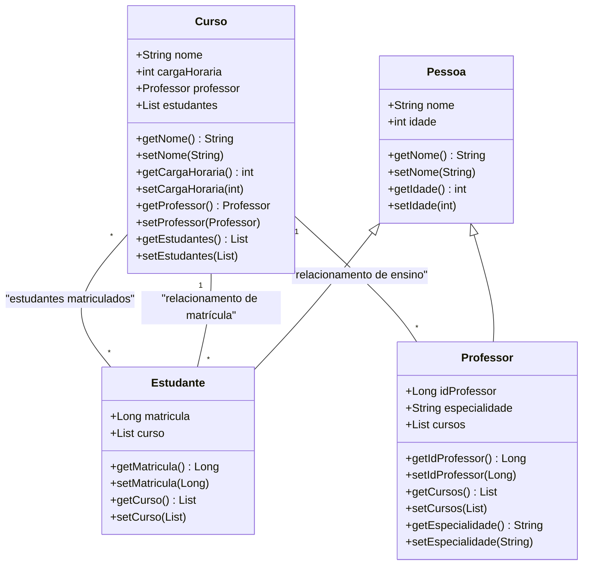

---

# Gerenciamento Estudantil

**Gerenciamento Estudantil** é um sistema de gerenciamento de alunos, professores e cursos, desenvolvido em Java. A aplicação possui uma interface gráfica que permite cadastrar e visualizar estudantes, professores e cursos. O sistema usa **Spring Boot** para a camada de backend e **JPA/Hibernate** para persistência de dados em um banco de dados relacional.

## Funcionalidades

- **Cadastro de Estudantes**: Cadastro de estudantes com nome, idade e matrícula.
- **Cadastro de Professores**: Cadastro de professores com nome, idade, especialidade e cursos atribuídos.
- **Gerenciamento de Cursos**: Criação e visualização de cursos com nome, carga horária e professor responsável.
- **Relacionamento entre Entidades**: A relação entre estudantes e cursos é feita através de uma associação `@ManyToMany`, e entre professores e cursos através de `@OneToMany`.

## Diagrama



## Tecnologias Utilizadas

- **Java 17**: Linguagem de programação principal.
- **Spring Boot**: Framework para desenvolvimento do backend.
- **JPA/Hibernate**: Para persistência de dados no banco de dados relacional.
- **Banco de Dados**: Relacional (MySQL, PostgreSQL, etc).
- **JavaFX**: Para construção da interface gráfica.
- **Maven**: Para gerenciamento de dependências e build do projeto.

## Estrutura do Projeto

1. **Model**: Contém as classes de entidade que representam os dados no banco de dados.
   - `Pessoa`: Classe abstrata para atributos comuns de pessoas (nome, idade).
   - `Estudante`: Herda de `Pessoa` e representa os estudantes.
   - `Professor`: Herda de `Pessoa` e representa os professores.
   - `Curso`: Representa os cursos oferecidos, contendo informações como nome, carga horária e o professor responsável.

2. **Repository**: Contém interfaces que estendem `JpaRepository` para cada entidade, permitindo operações CRUD fáceis no banco de dados.
   - `EstudanteRepository`
   - `ProfessorRepository`
   - `CursoRepository`

3. **Service**: Contém a lógica de negócios. É responsável por chamar os repositórios e manipular os dados antes de retorná-los à camada de controle.

4. **Controller**: Contém a lógica da interface gráfica. Manipula eventos, exibe telas e interage com os serviços para fornecer funcionalidade ao usuário.

5. **Interface Gráfica**: Utiliza **JavaFX** para criar uma interface de fácil utilização onde os usuários podem interagir com o sistema para realizar os cadastros e visualizações.

## Instalação

### Pré-requisitos

1. **Java 17**: Certifique-se de que o Java 17 está instalado em sua máquina.
2. **Banco de Dados Relacional**: Configure o banco de dados relacional de sua preferência (MySQL, PostgreSQL, etc).
3. **Maven**: Para instalar dependências e gerar o projeto.

### Passos para Instalar

1. Clone este repositório para sua máquina local:

   ```bash
   git clone https://github.com/seu-usuario/seu-repositorio.git
   ```

2. Navegue até o diretório do projeto:

   ```bash
   cd seu-repositorio
   ```

3. Certifique-se de ter o **Java 17** e o **Maven** instalados.

4. Para instalar as dependências do projeto, execute:

   ```bash
   mvn install
   ```

5. Configure seu banco de dados no arquivo `application.properties`:

   ```properties
   spring.datasource.url=jdbc:mysql://localhost:3306/seu_banco
   spring.datasource.username=seu_usuario
   spring.datasource.password=sua_senha
   spring.jpa.hibernate.ddl-auto=update
   ```

6. Para rodar a aplicação:

   ```bash
   mvn spring-boot:run
   ```

   A aplicação será iniciada com a interface gráfica.

## Como Usar

- **Tela Principal**: A tela inicial exibe um menu com opções para cadastrar estudantes, professores e cursos.
- **Cadastro de Estudantes**: Clique na opção "Cadastrar Estudante", preencha os campos obrigatórios (nome, idade, matrícula) e clique em "Salvar".
- **Cadastro de Professores**: Clique na opção "Cadastrar Professor", preencha os campos obrigatórios (nome, idade, especialidade) e clique em "Salvar".
- **Cadastro de Cursos**: Clique na opção "Cadastrar Curso", preencha os campos obrigatórios (nome, carga horária, professor) e clique em "Salvar".
- **Visualização de Dados**: Clique na opção "Visualizar" para consultar os estudantes, professores e cursos cadastrados.

## Estrutura da Interface Gráfica

A interface gráfica é construída com **JavaFX** e permite ao usuário realizar as seguintes operações:

- Cadastrar novos estudantes, professores e cursos.
- Visualizar os dados cadastrados em uma lista.
- Editar ou excluir registros.

### Exemplos de Telas

- **Tela de Cadastro de Estudante**:
  - Campos: Nome, Idade, Matrícula.
  - Botão: "Salvar".

- **Tela de Cadastro de Professor**:
  - Campos: Nome, Idade, Especialidade.
  - Botão: "Salvar".

- **Tela de Cadastro de Curso**:
  - Campos: Nome do Curso, Carga Horária, Professor Responsável.
  - Botão: "Salvar".

## Contribuição

1. Faça um fork deste repositório.
2. Crie uma branch para sua feature (`git checkout -b feature/MinhaFeature`).
3. Commit suas alterações (`git commit -m 'Adicionando nova feature'`).
4. Push para a branch (`git push origin feature/MinhaFeature`).
5. Abra um Pull Request.

## Licença

Distribuído sob a licença MIT. Veja o arquivo [LICENSE](LICENSE) para mais informações.

---
